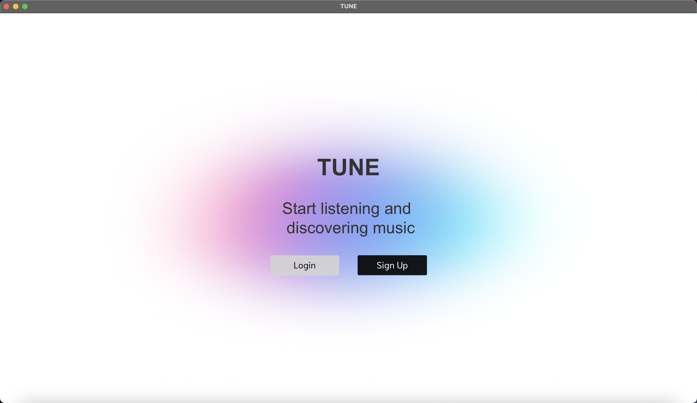
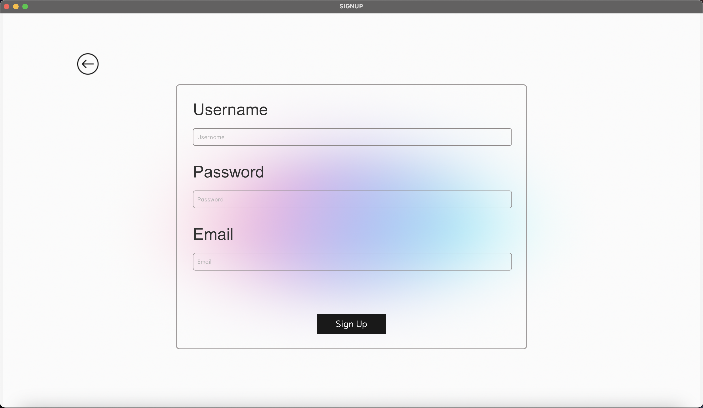
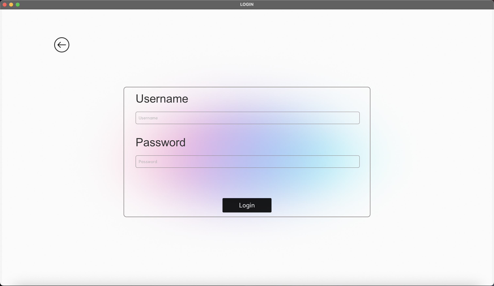
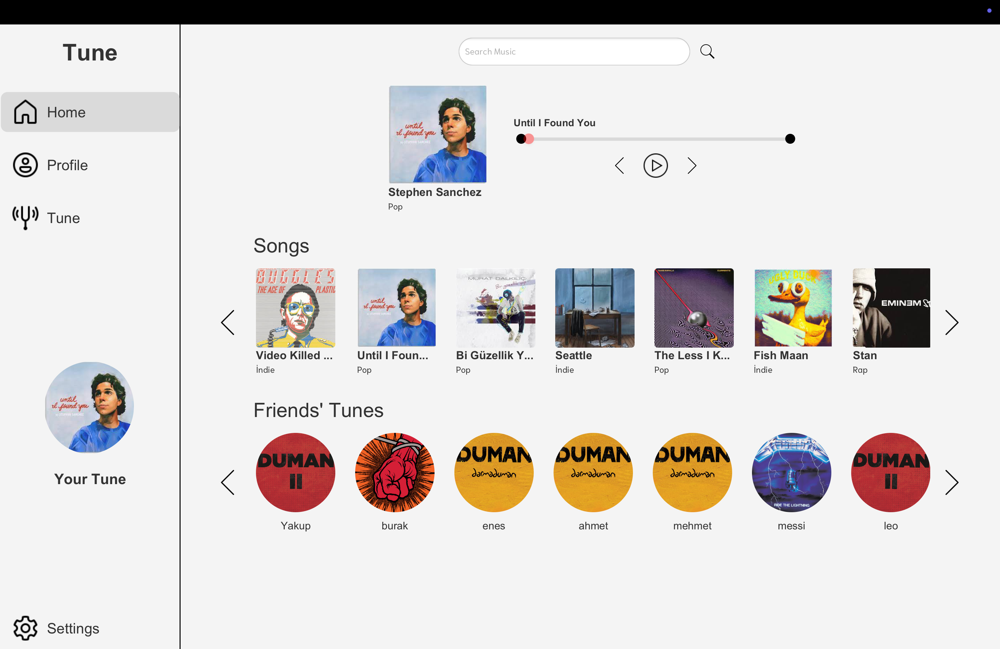
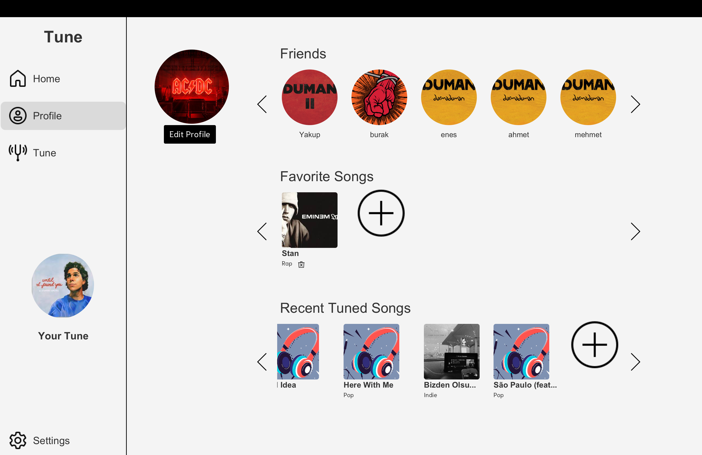
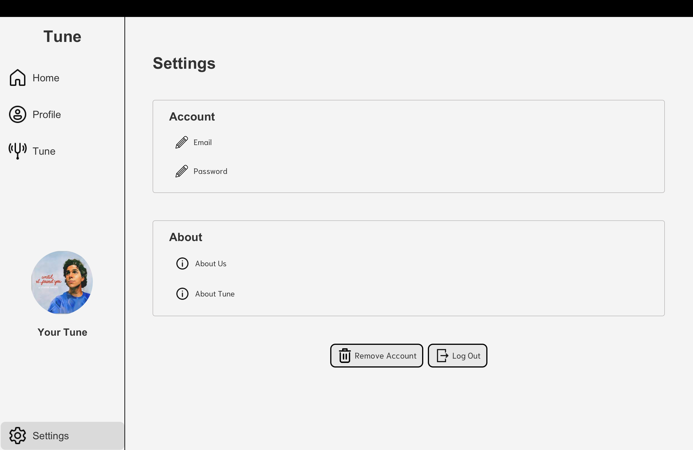
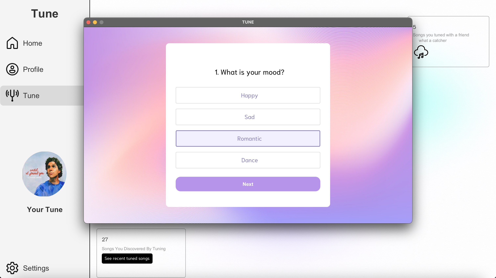

# 🎵 Tune - A Music Application

Tune is a music application developed by a team of first-year Computer Engineering students at Bilkent University as part of our CS-102 course project. It was built with the aim of providing a simple and enjoyable way to explore and listen to music.

## 📱 Features

- 🎶 Browse a collection of songs
- 🔍 Search songs by name
- ❤️ Add songs to favorites
- 🌐 Custom APIs for handling song data
- ▶️ Play music directly via Spotify API integration
- 🖥️ Intuitive and user-friendly UI
- 🗄️ MongoDB-based database system (remote)

## 🚀 Technologies Used

- Java – Core application development
- JavaFX – Graphical User Interface
- MongoDB – Music data storage (remote)
- Custom REST APIs – Data communication
- Spotify Web API – Streaming music playback

## 👥 About Us

We are a team of first-year Computer Engineering students at Bilkent University, and we’ve developed Tune, a music application, as part of our CS-102 course project.

Our app integrates the Spotify API to provide seamless music playback directly within the app, combining our own music database with the power of Spotify’s streaming service.

### Team Members & Roles:

- Kaptan Kaan Yıldırım – Database Lead  
  Responsible for designing and managing the structure and operations of our music database.

- Burak Yılmaz Zor – API Lead, UI Contributor  
  Developed the APIs for the app and contributed to the UI design.

- Yakup Emre Çelebi – UI Lead  
  In charge of crafting an intuitive and user-friendly interface for the application.

- Enes Akbulut – Data Control  
  In charge of sourcing songs and adding them to the database.

- Yusuf Mert Balcı – Data Control  
  Also responsible for sourcing and adding songs to the database.

Our passion for music and technology united us to create something meaningful and fun. Tune is more than just a project — it represents our teamwork, creativity, and what we can achieve together.

## 🛠️ Getting Started

To run the Tune music application on your local machine, follow these steps:

1. Clone the Repository  
   git clone https://github.com/burakzor/Tune.git  
   cd Tune

2. Open the Project in IntelliJ IDEA or Eclipse  
   - Launch your Java IDE.  
   - Select File > Open and navigate to the Tune directory.  
   - Let the IDE index and build the project.

3. Setup MongoDB Database  
   - This project uses a remote MongoDB database hosted online.  
   - Ensure you have access credentials and the connection string from your database provider.

4. Configure the Database Connection  
   - Update the MongoDB connection string in the code to use your remote database URL and credentials, for example:  
     `MongoClient mongoClient = new MongoClient(new MongoClientURI("your-remote-mongodb-connection-string"));`

5. Run the Application  
   - just run Start.java

The application should launch with its full graphical interface and functionality, connected to the remote database.

## 📸 Screenshots

Here are some screenshots of the Tune application in action:

🎵 Welcome Screen  

Sign Up Screen  

Login Screen 

Home Screen

Profile Screen

Settings Screen

Tune Recommendation Screen

Detailed Tune Recommendation Screen

## 📄 License

This project was developed for educational purposes as part of a university course assignment. It is not intended for commercial use.

##Author

This README was generated by ChatGPT based on the GPT-4o-mini model.
